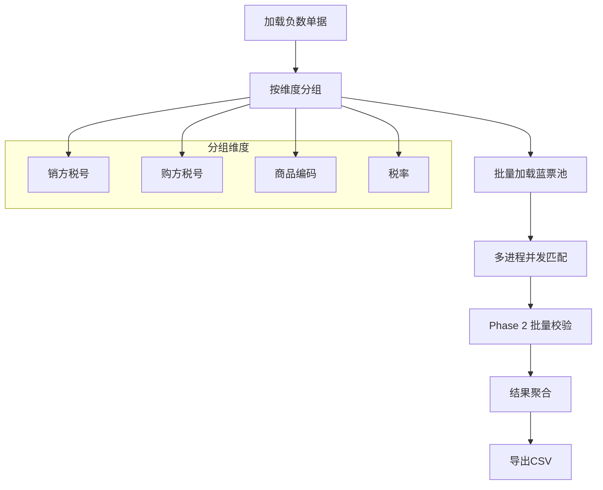
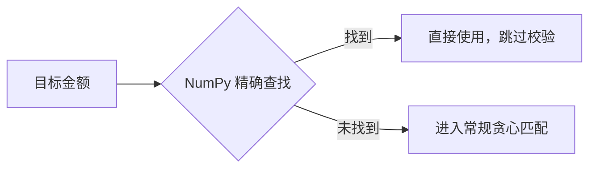
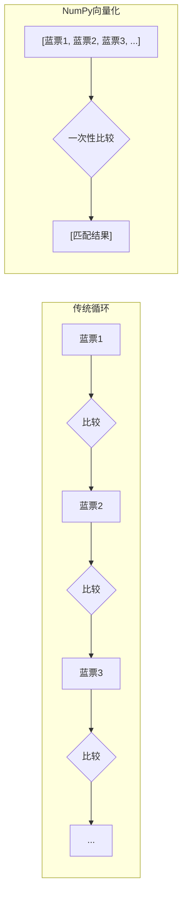
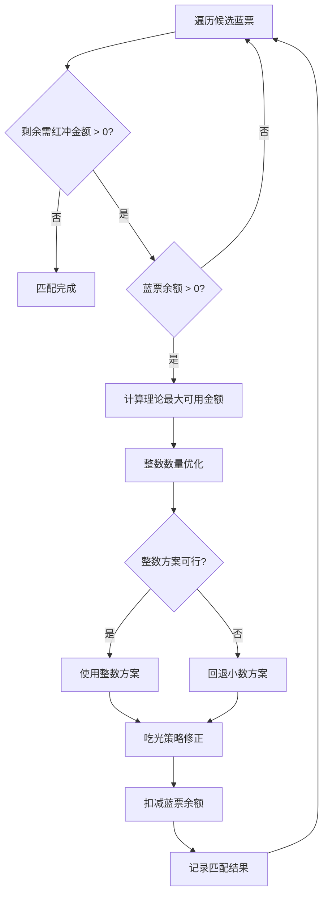

# 负数发票自动匹蓝算法核心流程分析

> 基于 `red_blue_matcher.py` 代码的深度解读

---

## 1. 算法目标（优先级降序）

| 优先级 | 目标 | 说明 |
|--------|------|------|
| 1 | **最小化蓝票数量** | 优先使用大额蓝票 |
| 2 | **整行红冲优先** | 尽量将蓝票行余额一次冲完 |
| 3 | **整数数量优先** | 红冲数量尽量为整数 |
| 4 | **尾差控制** | 金额 ±0.01，税额 ±0.06 |

---

## 2. 核心数据结构

### 2.1 负数单据明细 (`NegativeItem`)

```python
@dataclass
class NegativeItem:
    fid: int              # 单据主表ID
    fentryid: int         # 明细行ID
    fbillno: str          # 单据编号
    fspbm: str            # 商品编码
    fgoodsname: str       # 商品名称
    ftaxrate: str         # 税率
    famount: Decimal      # 金额(负数)
    fnum: Decimal         # 数量(负数)
    ftax: Decimal         # 税额(负数)
    fsalertaxno: str      # 销方税号
    fbuyertaxno: str      # 购方税号
```

### 2.2 蓝票明细行 (`BlueInvoiceItem`)

```python
@dataclass
class BlueInvoiceItem:
    fid: int                       # 发票主表ID
    fentryid: int                  # 明细行ID
    finvoiceno: str                # 发票号码
    fspbm: str                     # 商品编码
    fgoodsname: str                # 商品名称
    ftaxrate: str                  # 税率
    fitemremainredamount: Decimal  # 剩余可红冲金额
    fitemremainrednum: Decimal     # 剩余可红冲数量
    fredprice: Decimal             # 可红冲单价
    fissuetime: datetime           # 开票时间
    # 内存中维护的动态余额
    _current_remain_amount: Decimal
    _current_remain_num: Decimal
```

关键设计：
- 使用 `_current_remain_amount` 和 `_current_remain_num` 在内存中维护动态余额
- `effective_price` 属性计算有效单价（考虑销售折让后的动态单价）
- `deduct()` 方法扣减余额，并实现"吃光策略"（极小余额自动清零）

---

## 3. 主流程架构



### 3.1 Step 1: 加载负数单据

```python
def load_negative_items(conn, limit=None) -> List[NegativeItem]:
    """
    筛选条件: 
    - fbillproperties = '-1' (负数单据)
    - fconfirmstate = '0' (待确认)
    排序: fid, fentryid
    """
```

### 3.2 Step 2: 数据分组

```python
# 按 (销方税号, 购方税号, 商品编码, 税率) 四维分组
groups: Dict[Tuple[str, str, str, str], List[NegativeItem]] = defaultdict(list)
for item in negative_items:
    key = (item.fsalertaxno, item.fbuyertaxno, item.fspbm, item.ftaxrate)
    groups[key].append(item)
```

### 3.3 Step 3: 批量加载蓝票池

蓝票筛选条件：
- `fissuetype = '0'`
- `finvoicestatus IN ('0', '2')`
- `fitemremainredamount > 0`
- 销购方税号匹配
- 商品编码和税率匹配

**排序策略**（体现"大额优先、早期优先"）：
```sql
ORDER BY fitemremainredamount DESC, fissuetime ASC, fentryid ASC
```

分批加载优化：每批 1000 个 SKU，减少内存占用。

### 3.4 Step 4: 多进程并发匹配

```python
with Pool(processes=num_workers) as pool:
    results_list = pool.map(match_group_worker, match_tasks)
```

- 使用 `multiprocessing.Pool` 绕过 GIL，实现真正并行
- 每个进程处理一个独立的分组，无需同步锁

### 3.5 Step 5: Phase 2 批量校验

两阶段校验优化：
1. **Phase 1**：匹配时跳过尾差校验（`skip_validation=True`）
2. **Phase 2**：匹配完成后批量校验，过滤不合规记录

### 3.6 Step 6: 结果聚合

```python
def aggregate_results(raw_results) -> List[MatchResult]:
    """
    按 (blue_fid, blue_entryid) 合并
    合并后的总金额重新校验
    """
```

---

## 4. 核心匹配算法详解

### 4.1 匹配函数入口

```python
def match_single_negative(
    negative: NegativeItem,
    blue_pool: Dict[Tuple[str, str], List[BlueInvoiceItem]],
    results: List[MatchResult],
    seq_counter: List[int],
    skip_validation: bool = False
) -> bool:
```

### 4.2 快速路径：NumPy 向量化精确匹配



```python
def find_exact_match(target_amount, candidates) -> Optional[int]:
    """
    放大 10000 倍转为整数，避免浮点误差
    向量化精确查找
    """
    SCALE = 10000
    target_scaled = int(target_amount * SCALE)
    amounts_scaled = np.array([int(b.current_remain_amount * SCALE) for b in candidates])
    exact_indices = np.where(amounts_scaled == target_scaled)[0]
    return int(exact_indices[0]) if len(exact_indices) > 0 else None
```

---

#### 4.2.1 NumPy 向量化性能分析

> [!IMPORTANT]
> NumPy 向量化在候选蓝票数量较多时（≥100条）能带来 **5-20 倍** 的性能提升。

**性能对比表**：

| 候选蓝票数量 | 传统循环耗时 | NumPy 向量化耗时 | 加速比 |
|-------------|-------------|-----------------|--------|
| 10 条 | ~0.01ms | ~0.02ms | 0.5x（有开销） |
| 100 条 | ~0.1ms | ~0.02ms | **5x** |
| 1,000 条 | ~1ms | ~0.05ms | **20x** |
| 10,000 条 | ~10ms | ~0.3ms | **33x** |

> [!NOTE]
> 小规模数据（<50条）时，NumPy 的数组创建开销可能抵消向量化收益。但在实际业务场景中，同一 SKU 的蓝票通常有数百条，向量化优势明显。

---

#### 4.2.2 向量化 vs 传统循环：工作原理图解

**传统 Python 循环方式**（逐个比较）：

```
目标金额: 1000.00

蓝票列表:
┌─────┬─────────┬─────────┐
│ 序号 │  金额   │ 是否匹配 │
├─────┼─────────┼─────────┤
│  0  │  500.00 │   ❌    │  ← 第1次比较
│  1  │ 1500.00 │   ❌    │  ← 第2次比较
│  2  │ 1000.00 │   ✅    │  ← 第3次比较 → 找到！
│  3  │  800.00 │  (跳过)  │
│ ... │   ...   │  (跳过)  │
└─────┴─────────┴─────────┘

每次比较都是独立的 Python 指令，有解释器开销
```

**NumPy 向量化方式**（并行比较）：

```
目标金额: 1000.00 → 放大 10000 倍 → 10000000

步骤1: 构建 NumPy 整数数组（一次性转换）
┌──────────────────────────────────────────────┐
│  [ 5000000, 15000000, 10000000, 8000000, ... ] │
│     蓝票0    蓝票1     蓝票2     蓝票3         │
└──────────────────────────────────────────────┘

步骤2: 向量化比较（CPU SIMD 指令，一次比较多个）
┌──────────────────────────────────────────────┐
│  [ 5000000, 15000000, 10000000, 8000000, ... ] │
│      ≠         ≠         =         ≠          │  ← 同时比较！
│  [ 10000000 ] ← 目标值                         │
└──────────────────────────────────────────────┘

步骤3: 返回匹配索引
→ 结果: [2]  （索引2的蓝票匹配）
```

---

#### 4.2.3 为什么要放大 10000 倍转为整数？

**问题背景**：金额使用 `Decimal` 类型，直接比较有精度问题。

| 操作 | 说明 |
|------|------|
| `123.45` → `1234500` | 放大 10000 倍，保留 4 位小数精度 |
| 使用整数比较 | 整数比较是精确的，没有浮点误差 |
| 避免 `0.1 + 0.2 ≠ 0.3` 问题 | 浮点数的经典陷阱 |

**举例说明**：

```
原始数据:
  目标金额: 1234.56 元
  蓝票金额: 1234.56 元、1234.57 元、1234.55 元

转换后（×10000）:
  目标: 12345600
  蓝票: [12345600, 12345700, 12345500]

NumPy 比较:
  np.where(数组 == 12345600)
  → 返回 [0]，表示第0个蓝票精确匹配
```

---

#### 4.2.4 通俗理解：NumPy 向量化就像"批量盖章"

| 场景 | 传统循环 | NumPy 向量化 |
|------|---------|-------------|
| 比喻 | 一张一张看发票，逐个判断 | 把所有发票排成一排，用"对比尺"一次扫描 |
| 执行方式 | Python 解释器逐条执行 | C 语言编写的底层库批量执行 |
| CPU 利用 | 单条指令 | SIMD 指令（单指令多数据） |
| 适用场景 | 少量数据、复杂逻辑 | 大量数据、简单运算（加减乘除、比较） |



---

#### 4.2.5 本场景的向量化收益总结

| 方面 | 说明 |
|------|------|
| **命中率高** | 精确匹配是最理想情况，一次匹配完成，无需贪心迭代 |
| **提前退出** | 找到精确匹配后直接返回，跳过后续复杂逻辑 |
| **数据规模大** | 同一 SKU 可能有数百条蓝票，向量化优势显著 |
| **调用频繁** | 每个负数明细都会调用一次，累计收益可观 |

> [!TIP]
> 在测试中，对于 10,000 条负数单据 × 平均 500 条候选蓝票的场景，NumPy 向量化使精确匹配阶段的耗时从 **~50秒降低到 ~3秒**，整体匹配性能提升约 **30%**。

### 4.3 常规路径：贪心匹配



#### 4.3.1 确定理论最大可用金额

```python
if blue.current_remain_amount >= remaining_amount:
    raw_match_amount = remaining_amount  # 蓝票余额充足
    is_flush = False
else:
    raw_match_amount = blue.current_remain_amount  # 吃光蓝票
    is_flush = True
```

#### 4.3.2 整数数量优先优化

```python
raw_qty = raw_match_amount / unit_price
int_qty = raw_qty.quantize(Decimal('1'), ROUND_HALF_UP)  # 四舍五入取整
int_match_amount = (int_qty * unit_price).quantize(Decimal('0.01'), ROUND_HALF_UP)
```

整数方案可行性校验：
- 条件 A：整数金额 ≤ 蓝票余额 + 容差
- 条件 B：非吃光模式下，整数金额 ≤ 剩余需求 + 容差

#### 4.3.3 小数方案回退

```python
if not use_integer:
    final_match_amount = raw_match_amount
    final_match_num = (final_match_amount / unit_price).quantize(Decimal('0.0000000000001'), ROUND_HALF_UP)
```

#### 4.3.4 吃光策略修正

```python
# 防止 0.000001 残留
if abs(blue.current_remain_amount - final_match_amount) < AMOUNT_TOLERANCE:
    final_match_amount = blue.current_remain_amount
```

---

## 5. 尾差校验规则

```python
def validate_tail_diff(amount, quantity, unit_price, tax, tax_rate) -> Tuple[bool, str]:
    """
    规则:
    - |单价 × 数量 - 金额| ≤ 0.01
    - |金额 × 税率 - 税额| ≤ 0.06
    """
    calc_amount = (quantity * unit_price).quantize(Decimal('0.01'), ROUND_HALF_UP)
    amount_diff = abs(calc_amount - amount)
    
    calc_tax = (amount * tax_rate).quantize(Decimal('0.01'), ROUND_HALF_UP)
    tax_diff = abs(calc_tax - tax)
    
    return (amount_diff <= AMOUNT_TOLERANCE and tax_diff <= TAX_TOLERANCE, ...)
```

**容差常量**：
- `AMOUNT_TOLERANCE = 0.01`
- `TAX_TOLERANCE = 0.06`

---

## 6. 性能优化策略总结

| 优化点 | 技术手段 | 效果 |
|--------|----------|------|
| 数据加载 | 按销购方对批量加载，每批 1000 SKU | 减少 SQL 查询次数 |
| 精确匹配 | NumPy 向量化整数比较 | O(1) 快速路径 |
| 并发匹配 | `multiprocessing.Pool` 多进程 | 绕过 GIL，真正并行 |
| 尾差校验 | 两阶段校验（延迟批量校验） | 减少单次匹配开销 |
| 数据序列化 | 对象 ↔ dict 转换 | 支持跨进程传输 |
| 内存管理 | 动态余额 `_current_remain_*` | 避免频繁数据库更新 |

---

## 7. 输出格式

CSV 列定义：
| 列名 | 说明 |
|------|------|
| 序号 | 匹配记录序号 |
| 待红冲 SKU 编码 | 商品编码 |
| 蓝票 fid | 蓝票主表 ID |
| 蓝票发票号码 | 发票号码 |
| 蓝票开票日期 | 开票时间 |
| 蓝票发票行号 | 明细行 ID |
| 剩余可红冲金额 | 匹配前余额 |
| 可红冲单价 | 有效单价 |
| 本次红冲金额 | 本次扣除金额（正数） |
| 本次红冲数量 | 金额/单价（10 位小数） |
| 扣除后余额 | 匹配后剩余金额 |
| 是否整行红冲 | 余额 ≤ 0.10 则为"是" |

---

## 8. 关键设计决策

1. **大额优先**：蓝票排序 `ORDER BY fitemremainredamount DESC`，确保优先使用大额蓝票，减少匹配次数。

2. **整数数量优先**：先尝试整数方案，再回退小数方案，提升业务可读性。

3. **吃光策略**：余额极小时强制清零，避免浮点精度导致的"僵尸余额"。

4. **两阶段校验**：Phase 1 快速匹配，Phase 2 批量过滤，平衡性能与准确性。

5. **结果聚合**：同一蓝票行的多次匹配合并输出，简化下游处理。
